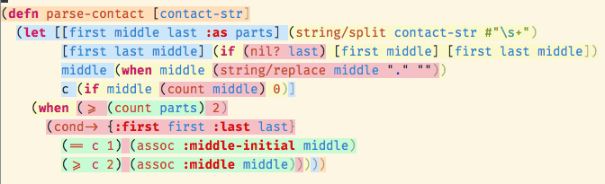
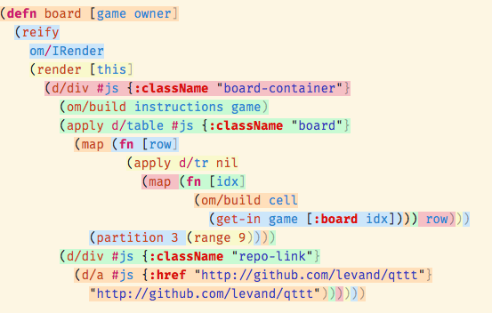

# Clojure Color Scope Syntax Theme

Theme offering various background colors according to the scope of a Clojure expression

This theme was created to facilitate the learning process of Clojure and ClojureScript.

